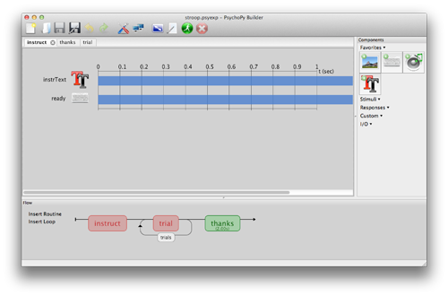
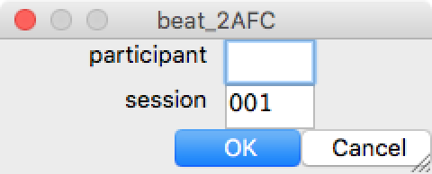
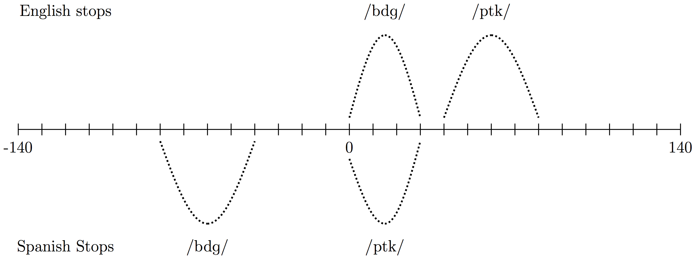
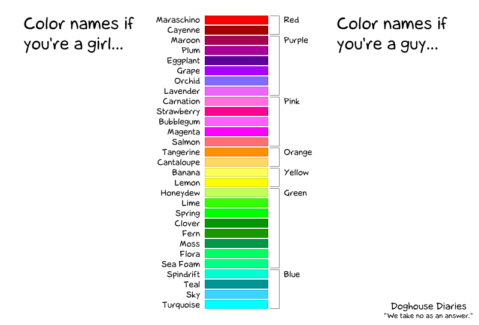
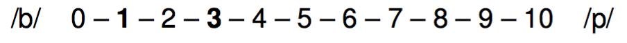
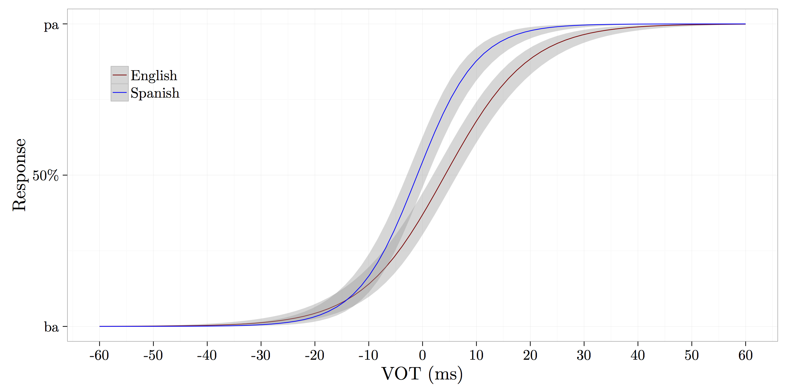

# Plan

- Resumen de PsychoPy2
- Mini experimento
- La percepción categórica
- Resultados del experimento

---
class: title-slide-section-grey

# PsychoPy2

---

## PsychoPy2

### ¿Qué es?

>- PsychoPy2 es un programa que sirve para realizar experimentos
- Se trata de presentar estímulos
  - palabras
  - imágenes
  - sonidos
  - etc.
- Se utiliza para crear experimentos de psycología, psycofísica, neurociencia, lingüística, etc.

---

## PsychoPy2

### ¿Por qué me interesa?

>- Es gratis
- Es una aplicación crosplataforma
- Podéis recrear los experimentos que estudiáis en clase

---

## Experimentos

- PsychoPy2 sirve para...
    - **2AFC**
    - AX, AXB, ABX
    - Decisión léxica (con masked prime)
    - Identificación de fonema
    - Juicios de gramaticalidad
    - etc.

---

## Para empezar

### Descargad la versión actual de PsychoPy2

- http://sourceforge.net/projects/psychpy/files/PsychoPy/
- También podéis buscar en google 'psychopy'
- Escoged la versión 'standalone' 

</br>

### Descargad archivos experimentales

- https://dl.dropboxusercontent.com/u/7256527/2AFC.zip

--- .segue bg:grey

# La interfaz

--- &twocolnocenter

## La interfaz (Modo 'coder')

*** =left

```
import itertools

def iter_primes():
  # an iterator of all numbers between 2 and +infinity
  numbers = itertools.count(2)

  # generate primes forever
  while True:
  # get the first number from the iterator
    prime = numbers.next()
    yield prime
for p in iter_primes():
  if p > 1000:
    break
  print p
```

*** =right

<div style="float: right">
  
</div>

---

## La interfaz (Modo 'builder')

<div style="float: right">
  
</div>

- Provee una GUI
- Representación lineal de la sequencia del experiment ('flow')
- Vista de los componentes

---

## La interfaz (Experiment flow)

- El experimento avanza de manera lineal de izquierda a derecha
- Cada elemento (una rutina) termina antes de avanzar
- Parecido a las diapositivas de una presentación power point

</br>

<div align="center">
  
</div>

---

## Las rutinas

- Vista individual de cada 'slide'
- Compuestas de una serie de componentes que realizan una tarea

<div align="center">
  
</div>

--- &twocol

## Lista de componentes

*** =left

- Stimuli
    - Texto/Audio/Img/Video
- Responses
	- Keyboard, lykert scales, button boxes, mouse tracking, eye tracking, microphone
- Custom
	- Python code

*** =right

<div style="float: right">
  
</div>

--- .segue bg:grey

# Demo

---

## 2AFC

- Two alternative forced choice
- También conocido como ```identification``` o ```classification```
- Se presenta un estímulo (normalmente audio)
- El estímulo se clasifica/identifica como una de dos opciones

---

<div align="center">
  
</div>

---

<div align="center">
  
</div>

<audio controls>
  <source src="./assets/img/sheep.ogg" type="audio/ogg">
  <source src="./assets/img/sheep.wav" type="audio/mpeg">
  Your browser does not support the audio element.
</audio>

---

<div align="center">
  
</div>

<audio controls>
  <source src="./assets/img/ship.ogg" type="audio/ogg">
  <source src="./assets/img/ship.wav" type="audio/mpeg">
  Your browser does not support the audio element.
</audio>

---

## Haced lo siguiente:

1. Descargad el experimento 2AFC [here](https://dl.dropboxusercontent.com/u/7256527/2AFC.zip)
2. Abrid el archivo '```2AFC.psyexp```'

---

</br>

<div align="center">
  
</div>

---

## Haced lo siguiente:

<div style="float:right">
    
    
  
</div>

1. Descargad el experimento 2AFC [here]()
2. Abrid el archivo '```2AFC.psyexp```'
3. Haced click in el icono verde
  - Participant = tus iniciales (ej. '**jc**')
  - Session = 001 
  - Haced click en '**ok**'
4. Usad las flechas del teclado para responder 
  - 'ba' (izquierda) 
  - 'pa' (derecha)
  - Responded lo más rápido posible sin hacer errores

---

## Haced lo siguiente:

<div style="float:right">
    
    
  
</div>

### Al terminar...

1. Id a la carpeta ```2AFC``` > ```data```
2. Buscar el archivo que termina en '.```csv```'
3. Eviádmelo (jvcasill@email.arizona.edu) con el asunto ```2AFC```

</br>

### Después... considerad las siguientes preguntas

- ¿Podemos producir un sonido (pongamos [ba]) varias veces de exactamente la misma manera? ¿Por qué sí o no?
- ¿Qué consecuencias tiene vuestra respuesta con respecto a la percepción del habla?

--- .segue bg:grey

# La percepción categórica

---

## ¿Cuáles son las diferencias entre /t/ del inglés y /t/ del español?

---

<div align="center">
    
</div>

<audio controls>
  <source src="./assets/img/taco.ogg" type="audio/ogg">
  <source src="./assets/img/taco.wav" type="audio/mpeg">
  Your browser does not support the audio element.
</audio>

---

## Inglés vs. español

### El sonido /t/ del español difiere del /t/ del inglés en cuanto al **punto de articulación** y VOT

<p></p>

- Punto de articulación: ¿Dónde se produce el contacto al pronunciar /t/?
  - /t/ del español es dental 
  - /t/ del inglés es alveolar

---

## Inglés vs. español

### El sonido /t/ del español difiere del /t/ del inglés en cuanto al punto de articulación y **VOT**

<p></p>

- **VOT** (voice-onset time): En las consonantes oclusivas, es la diferencia (en milisegundos) entre la explosión de la consonante y el comienzo de la fonación.
  - Es el resultado de la coordinación de gestos articulatorios (la explosión y la vibración de las cuerdas vocales)
  - VOT puede ser negativo, 0, o positivo y se usa para contrastar entre sonido sordos/sonoros

---

## VOT

<div style="float:right">
  
  
</div>

- Español e inglés mantienen un contraste entre /**p t k**/ and /<BLUE>b d g</BLUE>/ 
- La realización fonética es diferente
  - Español: /d/ tiene lead VOT y /t/ tiene short-lag VOT
  - Inglés: /d/ tiene short-lag VOT y /t/ tiene aspiración

---

</br></br>

<div align="center">
  
</div>

---

## La percepción del habla

- ¿Cómo diferenciamos entre el habla y el ruido?
- ¿Cómo extraemos la información relevante de una señal pobre?

---

## La ausencia de invarianza

- Los sonidos del habla nunca se pronuncian de la misma forma
- Si digo ```taco``` [ˈta.ko] 10 veces, nunca es físicamente igual 
- ¿Cómo es que somos capaces de relacionar el sonido con el concepto de un fonema?

---

## La percepción categórica

- "Equal sized physical differences are not equal sized psychologically."
- No percibimos los continuos como continuos...
- Las diferencias dentro de la misma categoría se disminuyen 
- Las diferencias entre categorías se aumentan

---

<div align="center">  
  
</div>

---

<div align="center">
   
</div>

---

<div align="center">
  
</div>

---

## La percepción categórica

- ¿Cómo estudiamos la percepción categórica?
  - 2AFC (identificación)
  - AX (discriminación)

---

</br></br></br>
<div align="center">
  
</div>

---

</br></br></br>
<div align="center">
  
</div>

---

</br></br></br>
<div align="center">
  
</div>

---

</br></br></br>
<div align="center">
  
</div>

---

</br></br></br>
<div align="center">
  
</div>

---

<div align="center">
  
</div>

---

<div align="center">
  
</div>

---

<div align="center">
  
</div>

---

## La percepción categórica

- "Equal sized physical differences are not equal sized psychologically."
- No percibimos los continuos como continuos...
- Las diferencias dentro de la misma categoría se disminuyen 
- Las diferencias entre categorías se aumentan

--- .segue bg:black

# La percepción categórica y el bilingüismo

</br></br></br></br></br></br></br></br></br></br></br>
**Pallier et al. (1997)**

---

## La percepción categórica

### Pallier et al. (1997)

- Bilingües secuenciales tempranos: español/catalán, catalán/español
- El catalán cuenta con un contraste vocálico que no existe en español (/e/-/ɛ/)

---

## La percepción categórica

### Pallier et al. (1997)

<p></p>
<div align="center">
   
  
</div>

---

## La percepción categórica

### Pallier et al. (1997)

- Bilingües secuenciales tempranos: español/catalán, catalán/español
- El catalán cuenta con un contraste vocálico que no existe en español (/e/-/ɛ/)
- Identificación (2AFC)
    - "¿Escuchaste [ˈ**pe**.**ɾa**] (Peter) o [ˈ<BLUE>pɛ</BLUE>.<BLUE>ɾa</BLUE>] (pera)?"
- Discriminación
    - "¿Son iguales o son diferentes?"

---

<div align="center">
  
</div>

---

<div align="center">
  
</div>

---

## La percepción categórica

### Pallier et al. (1997)

- Conclusión
  - Los bilingües tempranos español/catalán no perciben el contraste entre las vocales /e/-/ɛ/ de manera categórica
  - Estar expuesto a una edad temprana (durante el periodo sensible) no parece ser suficiente

--- .segue bg:black

# La percepción categórica y el bilingüismo

</br></br></br></br></br></br></br></br></br></br></br>
**Language-specific stop perception in highly proficient Heritage Speakers**


---

## La percepción categórica 

### Bilingual Language Modes (Grosjean, 1998)

>[...] state of activation of the bilingual's languages and language processing 
>mechanisms at a given point in time (Grosjean, 2002)

- Activation of languages increases/decreases as a function of communicative setting
  - Bilingual mode: both languages activated
  - Unilingual mode: one language activated
- Some bilinguals can reduce cross-language interactions in a unilingual setting (Antoniou et al. 2010; Magloire and Green 1999)
- **Do highly proficient HSs inhibit cross-language interaction effects a unilingual setting?**

---

</br>
<div align="center">
  
</div>

---

## Method

### Participants

- 9 highly proficient Spanish/English bilinguals
  - 6 females
  - 3 males
- Young adults: ages 20-26 
- Bilingual Language Profile (BLP) questionnaire (-10.16)

---

## Method

### Materials

- Female simultaneous bilingual speaker
  - ba/pa productions
  - 'fri' [fɾi] and [fɹi] productions
  - append lead voicing for /ba/, aspiration for /pa/ (Gonzales & Lotto, 2013)
- Two 13-step continua (-60ms to 60ms, 10ms increments)
  - 'Spanish' ba[fɾi]-pa[fɾi]
  - 'English' ba[fɹi]-pa[fɹi]

---

## Method 

### Procedure

<div style="float:right">
  </img>  
  </br></br>
  </img>
</div>

- Participants completed two 2AFC identification tasks
    - Session 1: Spanish - ba[fɾi]-pa[fɾi]
        - All instructions, materials in Spanish
        - All correspondence with investigator in Spanish
    - Session 2: English (24 hrs later) - ba[fɹi]-pa[fɹi]
        - All instructions, materials in English
        - All correspondence with investigator in English

---

<div align="center">
  
</div>

</br>
>- Overall probability of selecting /pa/ decreases by 38% when hearing English stimuli

---

## Summary of findings

- Higher proportion of 'pafri' responses in Spanish session
- HSs shifted their perceptual boundary to accommodate English stimuli in session 2

---

## Discussion

- HSs maintain separate phonetic systems, shift between them according to the language context
- No (less) cross-language activation in unilingual settings

--- .segue bg:grey

# Percepción categórica en SPAN 459

---


## Dealing with results

- Specify the output format
- Import results directly into stats program

```{r echo=TRUE}
library(knitr)
read_chunk('./assets/scripts/analysis.R')
```

```{r 'loadClean', echo=FALSE}
```

```{r}
glimpse(df)
```

---

## 

```{r 'responsePlot', echo=FALSE, fig.align='center', fig.width=13, fig.height=8.5, cache=FALSE}
```

---

## 

```{r 'responseMod', echo=FALSE, fig.align='center', fig.width=13, fig.height=8.5, cache=FALSE}
```

---

## 

```{r 'rtPlot', echo=FALSE, fig.align='center', fig.width=13, fig.height=8.5, cache=FALSE, warning=FALSE, message=FALSE}
```

---

## 

```{r 'table1', echo=FALSE, results='asis'}
```

---

## 

```{r 'table2', echo=FALSE, results='asis', cache=FALSE}
```

---

## Conclusión

<div style="float:right">
  
  
</div>

- Ahora sabéis lo básico de psychopy2
  - Podéis utilizarlo para crear experimentos psycolingüísticos
  - Tenéis acceso a la plantillas que podéis modificar

</br>

- La percepción categórica
  - "Equal sized physical differences are not equal sized psychologically."
  - No percibimos los continuos como continuos...


---

## More resources

- http://www.jvcasillas.com/teaching/psychopy/
- http://www.psychopy.org/ 
- http://code.google.com/p/psychopy/ 
- http://www.youtube.com/watch?v=VV6qhuQgsiI

---

## References

- <font size="5">Gray, J. & Pasmanter, N. (2013). [github][github]</font>
- <font size="5">Lejuez, C. W., Aklin, W. M., Zvolensky, M. J., & Pedulla, C. M. (2003). Evaluation of the Balloon Analogue Risk Task (BART) as a predictor of adolescent real-world risk-taking behaviours. Journal of adolescence, 26(4), 475-479. </font>
- <font size="5">McGuire, G. (2010, in progress) A Brief Primer on Experimental Designs in Speech Perception Research. http://people.ucsc.edu/~gmcguir1/ </font>
- <font size="5">Simonet, M. (2012). El diseño de experimentos para el estudio de la percepción del habla. *Laboratory Approaches to Romance Phonology Conference*. El Colegio de México, México D.F.</font>


[github]: https://github.com/psychopy/psychopy/tree/master/psychopy/demos/builder/mental_rotation


